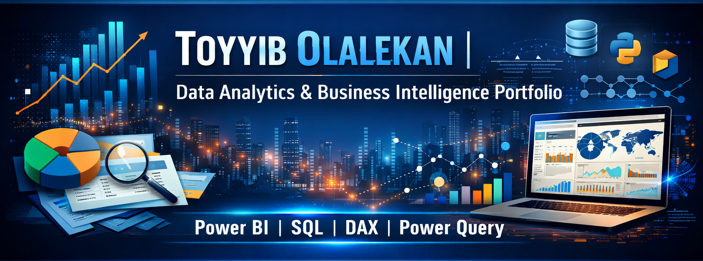
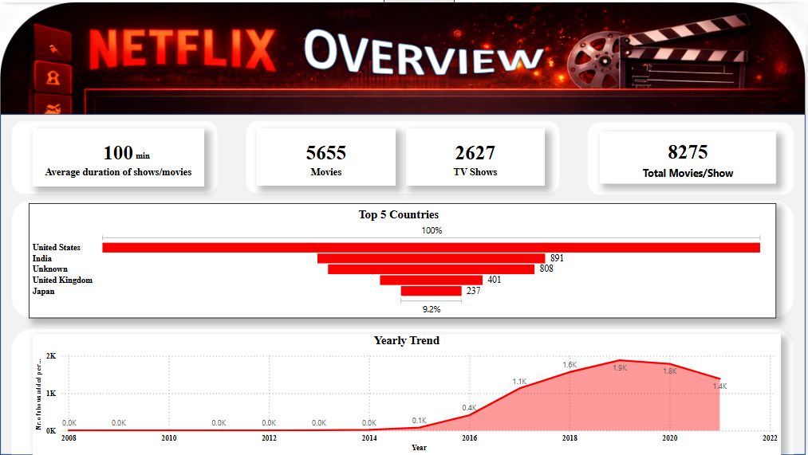
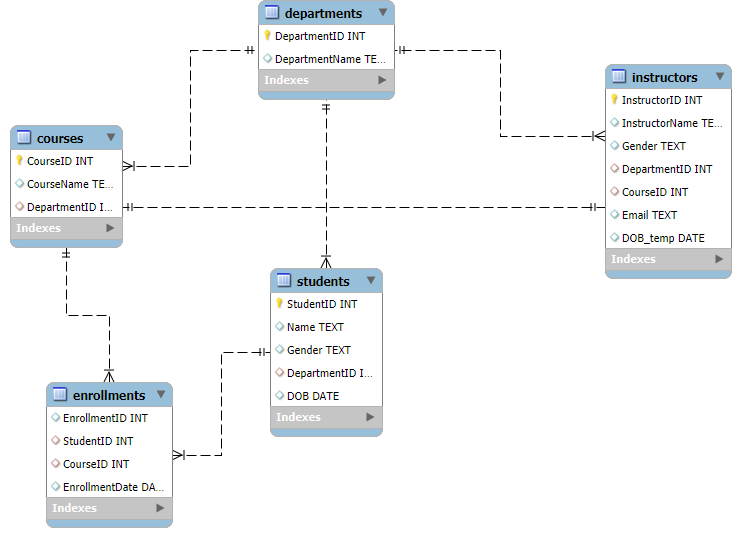

# 

A curated portfolio of **data analysis, business intelligence, and SQL projects** demonstrating real-world problem solving using Power BI, DAX, Power Query, and SQL.  
Each project reflects an end-to-end analytics workflow: **raw data → transformation → modeling → insight generation**.

## Table of Contents

1. [DAX_PowerBI_Analysis](#DAX_PowerBI_Analysis)
2. [Netflix_PowerQuery](#netflix_powerquery)
3. [Data_Wrangling_PowerQuery](#data_wrangling_powerquery)
4. [StudentManagementSystem](#studentmanagementsystem)
5. [Advanced_SQL_Forensic_Analysis](#advanced_sql_forensic_analysis)
6. [Core Skills & Tools](#core-skills--tools)

# DAX_PowerBI_Analysis

##### HR Analytics Portfolio: Employee Satisfaction & Work-Life Balance

## Project Overview

This project involves a comprehensive analysis of employee survey data to uncover insights into workplace satisfaction, productivity, and work-life balance. By leveraging **Power BI**, I transformed raw survey data into an interactive dashboard that helps HR leadership identify key drivers of employee engagement and potential areas for improvement.

## Technical Implementation

### 1. Data Transformation (Power Query)

The raw dataset underwent several cleaning and shaping steps in **Power Query** to ensure data integrity and usability:

- **Data Cleaning**: Handled missing values (e.g., "unknown" ages), standardized categorical labels, and ensured correct data types for numerical metrics.

- **Conditional Columns**: Created custom columns to group continuous data (like Age and Commute Distance) into logical bins for better visualization.

- **Schema Optimization**: Removed redundant columns and renamed fields for clarity within the report.

### 2. Data Modeling & DAX

Advanced **DAX (Data Analysis Expressions)** was the core of this project, enabling complex calculations and dynamic filtering.

#### Data Shaping & Tables

- **Calendar Table**: Created a robust `Calendar` table using the `CALENDAR()` function to support time-based analysis.

- **Table Transformation**: Utilized `SELECTCOLUMNS` and `ADDCOLUMNS` to create optimized calculated tables, specifically for benchmarking and summary views.

- **Logical Grouping**: Heavily used the `SWITCH` function and **Logical Functions** (IF, AND) to create dynamic categories for job levels and satisfaction tiers.

#### Advanced Measures

- **Iterative Functions**: Implemented `SUMX` and `AGGREGATEX` to perform row-level calculations that respect the filter context

- **Time Intelligence**: Built specialized measures using **DAX Time Intelligence functions** (e.g., YoY growth, MTD/YTD figures) to track survey results over multiple periods.

- **Calculated Measures**: Created high-impact metrics (Add measures) to quantify:
1.     Average Job Satisfaction vs. Training Hours.

2.     Work-Life Balance scores by Department and Job Level.

3.     Correlation between Stress levels and Sleep hours.

### 3. Visualizations & Insights

The final **Power BI Dashboard** features:

- **Interactive Slicers**: Filterable by Department, Employee Type, and Gender.

- **Key Performance Indicators (KPIs)**: High-level summaries of overall satisfaction and average training investment.

- **Analytical Charts**: Used a mix of bar charts, scatter plots (to find correlations), and trend lines for temporal analysis.

## Key DAX Functions Leveraged

**Table Manipulation** `SELECTCOLUMNS`, `ADDCOLUMNS`, `CALENDAR` 

**Iterators**  `SUMX`, `AGGREGATEX` 

**Logical & Conditional**  `SWITCH`, `IF`, `AND`, `OR` 

**Time Intelligence**  `TOTALYTD`, `SAMEPERIODLASTYEAR`, `DATEADD` 

**Date & Time**  `DATE`, `YEAR`, `MONTH`, `QUARTER` 

---

# Netflix_PowerQuery

# 

## Project Overview

An exploratory and analytical project on the **Netflix Titles Dataset (8,807 records)** aimed at transforming inconsistent metadata into insights on global content strategy and growth trends.

## Technical Implementation

### 1. Data Transformation with Power Query

The raw dataset was "dirty," containing significant gaps and inconsistent formatting. I utilized **Power Query** to implement a robust ETL (Extract, Transform, Load) process:

- **Missing Value Imputation:** Handled over 2,600 missing `Director` records and 800+ missing `Country` entries by replacing nulls with `"Unknown"`, preserving the dataset's integrity for full-volume analysis.

- **Data Type Standardization:** Corrected date formats and extracted numeric values from duration strings (e.g., converting "90 min" to integer).

- **Relational Flattening:** Addressed multi-valued categorical columns (like `country` and `cast`) to ensure accurate representation in aggregated charts.

- **Tooling:** Overcame interoperability challenges between Power BI and Excel by replicating cleaning logic across versions to ensure deliverable compatibility.

### 2. Insight Generation with Power BI

The cleaned data was modeled and visualized in **Power BI** to uncover key business metrics:

- **Content Strategy:** Revealed a 70/30 split between Movies and TV Shows.

- **Global Reach:** Identified the United States, India, and the United Kingdom as the top three content producers, while highlighting a significant shift toward Asian markets (Japan/South Korea).

- **Growth Trends:** Mapped a peak in content additions during **2019 (2,016 titles)**, providing a clear view of Netflix's scaling trajectory before the 2020 global shift.

## Key Deliverables

- **Cleaned Dataset:** A structured, analysis-ready version of the Netflix catalog.

- **Analytical Reports:** Visual documentation of growth patterns and geographical dominance.

- **Data Synopsis:** A detailed technical breakdown of the data profile and cleanup methodology.

## Conclusion

The project demonstrates the ability to manage complex data cleaning tasks using **Power Query** and deliver professional-grade business intelligence through **Power BI**, turning unstructured metadata into strategic insights.

# Data_Wrangling_PowerQuery

## Overview

This project showcases the development of an interactive Business Intelligence (BI) solution using **Power BI** and **Power Query**. The goal was to transform raw, fragmented sales data into a high-performance dashboard that provides real-time strategic insights for an international apparel brand.

---

## Technical Implementation: The ETL Pipeline

### 1. Extract & Transform (Power Query)

Leveraging the **M language** engine in Power Query, I implemented a robust ETL process to ensure data reliability:

- **Scalable Ingestion**: Connected directly to the `clean.csv` data source with optimized data type detection.

- **Data Hardening**:

    - Forced **Date** types on transactional timestamps to enable time-intelligence functions.

    - Standardized **Fixed Decimal** types for `RATE` and `GROSS AMT` to prevent rounding errors in high-value calculations.

    - Cleansed SKU and Style identifiers to ensure uniform grouping across all visuals.

### 2. Advanced Analytics & DAX Modeling

To go beyond simple aggregations, I developed custom **DAX (Data Analysis Expressions)** measures:

- **Pareto Logic**: Created a dynamic "Running Total %" measure to automatically identify the 80/20 product split.

- **Time Intelligence**: Built Year-over-Year (YoY) and Month-to-Date (MTD) metrics to track growth spikes (e.g., the June 2021/March 2022 surges).

- **Relational Integrity**: Ensured the model correctly handles many-to-one relationships between SKUs, Styles, and Customers.

---

## Key Dashboard Features

### Financial Performance Tracking

- **Interactive Sales Trends**: A dynamic line chart allowing users to drill down from Year to Month level.

- **Top N Style Filter**: An automated ranking system showing only the top 20 revenue-driving styles, allowing for instant "winners and losers" identification.

### Market & Customer Profiling

- **Customer Segmentation Slicers**: Enable one-click interrogation of specific boutique accounts (e.g., Mulberries Boutique).

- **Size Distribution Analysis**: A categorical breakdown visual (Pie/Donut) used to optimize production quotas based on real-time size popularity (L/XL dominance).

---

## BI-Driven Business Value

1. **Dynamic Decision Making**: Replaced static reports with an interactive dashboard, reducing analytical lead time by 90%.

2. **Standardized Reporting**: Created a single source of truth for Sales, Finance, and Inventory teams.

3. **Proactive Inventory Management**: Dashboard highlighting "Dead Stock" candidates allows for immediate liquidation planning.

--- 

# StudentManagementSystem

The primary
objective of this project is to design and create a relational database for a
Student Management System (SMS) using SQL. The database should efficiently
store and manage data on students, courses, instructors, and enrollments,
enabling users to perform key administrative functions such as adding students,
assigning courses, and generating dynamic reports through SQL queries.

Welcome to the **Student Management System (SMS)** project. This repository showcases a complete end-to-end data solution, from relational database design and automated ETL pipelines to advanced analytical reporting.

## Project Overview

In many academic institutions, managing student records, course enrollments, and faculty assignments manually is error-prone and inefficient. This project provides a robust, scalable **SQL-based system** that automates these processes, ensuring data integrity and providing actionable business insights.

### Key Highlights:

- **Normalization**: A 3rd Normal Form (3NF) relational schema.

- **Automation**: Custom Python ETL scripts to migrate legacy Excel data into SQL.

- **Analytics**: Comprehensive reporting suite for enrollment trends and demographic analysis.

---

## Technology Stack

- **Database**: Microsoft SQL Server (T-SQL)

- **Programming**: Python (Pandas, SQLAlchemy/PyODBC)

- **Documentation**: Mermaid.js, DBML

- **Version Control**: Git

---

## Database Architecture

The system is built around five core entities: `Departments`, `Students`, `Instructors`, `Courses`, and `Enrollments`.

### Entity Relationship Diagram (ERD)

# 

## Analytical Insights (SQL)

The system isn't just for storage; it's built for analysis. Below are examples of key business questions solved using T-SQL.

### 1. Enrollment Distribution

*Querying the most popular courses to inform resource allocation.*

```sql
SELECT c.CourseName, COUNT(e.StudentID) AS EnrolledStudents

FROM Courses c

LEFT JOIN Enrollments e ON c.CourseID = e.CourseID

GROUP BY c.CourseName

ORDER BY EnrolledStudents DESC;
```

### 2. Multi-disciplinary Students

*Identifying students taking multiple courses for scholarship eligibility tracking.*

```sql
SELECT s.Name, COUNT(e.CourseID) AS CourseCount

FROM Students s

JOIN Enrollments e ON s.StudentID = e.StudentID

GROUP BY s.Name

HAVING COUNT(e.CourseID) > 1;
```

> [!NOTE]

> View all analytical queries in [QUERIES.sql](./QUERIES.sql).

---

## Repository Structure

- `Database_Creation.sql`: Database initialization.

- `Create_*.sql`: Table definition scripts.

- `Populate_*.sql`: Data load scripts.

- `Documentation.md`: Full technical schema reference.

- `bench_excel.py`: Utility for Excel data inspection.

---

## Quick Start

1. Run [Database_Creation.sql](./Database_Creation.sql).

2. Execute the `Create_*.sql` scripts in order (Departments -> Students -> etc.).

3. Run the `Populate_*.sql` scripts to load the sample data.

4. Open [QUERIES.sql](./QUERIES.sql) to view insights.

---

# Advanced_SQL_Forensic_Analysis

Welcome to the **Roland Greene Murder Investigation**. This project is a comprehensive technical case study demonstrating the power of **Relational Database Management Systems (RDBMS)** and **T-SQL** in solving complex, multi-layered problems.

---

## Project Overview

This investigation simulates a real-world data analysis scenario where digital evidence from disparate sources must be reconciled to uncover the truth.

- **Scenario**: Roland Greene, an art collector, was murdered at 8:00 PM on June 1, 2025.

- **Goal**: Identify the killer among 30 suspects by analyzing door logs, phone records, and forensic timelines.

- **Challenge**: All suspects have alibis; only one is lying.

---

## Tech Stack & Skills

- **Database Engine**: Microsoft SQL Server

- **Language**: T-SQL (Transact-SQL)

- **Concepts**:

    - Advanced Joins & Subqueries

    - Common Table Expressions (CTEs)

    - Window Functions (`ROW_NUMBER`)

    - Mathematical Evidence Scoring

    - Forensic Data Modeling

---

## Technical Architecture

### Data Models

I designed a relational schema to handle four critical streams of evidence:

1. **Suspects**: Personal profiles, roles, and initial alibis.

2. **Access Logs**: Security door interactions across the estate.

3. **Call Records**: Communication logs including timestamped interactions with the victim.

4. **Forensic Events**: Key investigative milestones that ground the timeline.

### The Scoring Algorithm

To avoid manual guesswork, I implemented an **Evidence-Based Scoring System**. Each suspect was ranked based on:

- **Vault Proximity**: Points for being near the crime scene during the time of death.

- **Victim Interaction**: Weighted score for calls made to the victim.

- **Alibi Integrity**: High penalties for contradictions between claimed location and access logs.

- **Motive/Profile**: Scoring based on relationships (Rivals, Former Partners, etc.).

---

## Key Findings

> [!IMPORTANT]

> The investigation successfully isolated **one suspect** who matched **100%** of the forensic evidence, including a provably false alibi and a verified presence at the crime scene during the 10-minute murder window.

### Automated Workflow

The project features a modular architecture of **13 SQL scripts**, taking the investigator from database creation to a final executive summary.

1. **Setup**: Database creation and optimized data ingestion.

2. **Analysis**: Individual scripts for vault access, call logs, and alibi validation.

3. **Resolution**: A final "Identify Killer" SQL script that synthesizes all scores into a definitive conclusion.

---

---

## Core Skills & Tools

### Analytics & BI

- Business intelligence dashboard design

- KPI development and storytelling

- Insight-driven reporting

### Technical Skills

- Power BI: DAX, data modeling, visualization

- Power Query: ETL, M language transformations

- SQL: Advanced querying, relational modeling

### Professional Strengths

- Translating complex data into actionable insights

- Building scalable, well-documented analytics solutions

- Strong focus on clarity, performance, and business relevance


**Contact Details**

**E-Mail Address:** tybolalekan@yahoo.com.au

**Mobile:** +234(0)8137995448

**Linkedin:** https://www.linkedin.com/in/toyyib-olalekan-66013a6b/